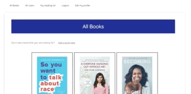

# Sinatra Book Club App

A Sinatra-powered web application used to save and track reading lists.

This app could be used for:
* Allowing a user to keep track of books read and books to read
* Saving user-generated books
* Browsing the reading lists of other users

This project was created as part of the [Flatiron School's Online Web Developer program](https://flatironschool.com/).

## Install Instructions

Visit https://book-club-sinatra-app.herokuapp.com/ to view and use the app.

## Contributors Guide

Bug reports and pull requests are welcome on GitHub at https://github.com/agiletkiewicz/book-club-sinatra-app. This project is intended to be a safe, welcoming space for collaboration, and contributors are expected to adhere to the [Contributor Covenant](http://contributor-covenant.org) code of conduct.

## Code of Conduct

Everyone interacting in the Sinatra Book Club App's codebases, issue trackers, chat rooms and mailing lists is expected to follow the code of conduct.

## License

The app is available as open source under the terms of the [MIT License](https://opensource.org/licenses/MIT).
